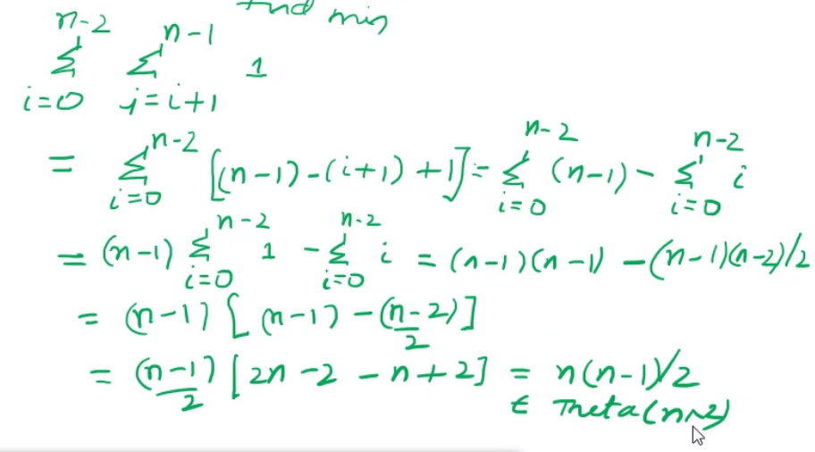
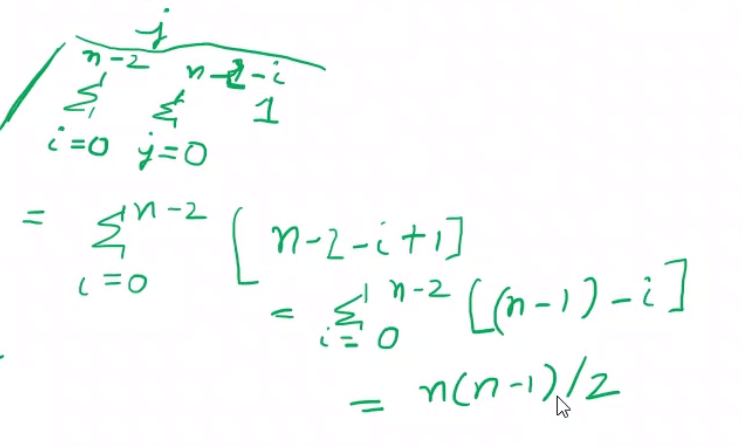

# Session-10 


Unit-1 is over! Overview :
- Concepts of algorithm 
- How to solve a problem 
- analyse of iterative algorithms
  - Aysmptotic growth 
- analyse recursive algorithm

Levitins 3rd edition
Unit-1 Assignment will be out tmrw.

## Unit-2 : 
- Brute Force 
- Sorting

Dromey : How to solve it by computers 

## Brute force 

Brute force a straight forward approach based on the definition of the problem.

Say power of a number, brute force approach : a^n : a * a* a*...

Now a more efficient approach will to take power of a.


Then why study this? : 
- May be the only method at times .
- gives a reasonable time for std problems.
- Lesser time for development 
- good for small problems 
- gives a base to compare better algorithms to compare with


## Inplace and Stable 
- Inplace :  No extra space than some const space 
- Stable : if 2 keys are of same values in predicate then they remain in the same place


## Sorting Problem 

- Input : a[0], a[1]...a[n-1]
- Output : a[0]<=a[i]<..a[n-1]
  - Predicate : Less than or equal 

Can we sort these : 
- int 
- String 
- Part of a structure
- one or more fields : combination of fields : composite keys 
- given predicate / logic : Yes possible, but we gone follow : 
  - Non decreasing/Ascending 

A simple algorithm to start with :  Find the smallest element 
```c
int find_min(int* a){
  int min = a[0];
  for(int i=1;i<n;i++){
    if(a[i]<min)
      min=a[i];
  }
  return min;
}
```
```c
int find_min_pos(int* a){
  int pos=0;
  for(int i=1;i<n;i++){
    if(a[i]<a[pos]){
      pos=i;
    }
  }
  return pos;
}
```

Use the idea of finding the minimum for sorting element, Selection sort??

### Selection sort

```c
int selectionsort(int* a,int n){
  for(int i=0;i<n-1;i--){ //VIMP  :only till n-2 will suffice!!!
  int pos = i;
    for(int j=n-1;j>=i;j--){
      if(a[j]<a[pos]){
        pos = j;
      }
    }
    int temp = a[pos];
    a[pos]=a[i];
    a[i]=temp;
  }
}
```

- Input size : n 
- Basic operation : Comparisons of key 
- Diff in time needed: NO
- No. of basic operation :
 

- Inplace : Yes 
- Stable :NO

Say you want to find the bottom 10ranks, can we do that using selectionsort?

The right way to do this using quick select (quick sort), but we can do using selection sort as well.


### Bubble sort :

```c
void bubblesort(int* a,int n){
  for(int i=0;i<n-1;i++){ //VIMP : observe that n-2
    for(int j=0;j<n-i-1;i++){
      if(a[j]>a[j+1]) 
        swap(a,j,j+1);
    }
  }
}
```
- Input size : n 
- Basic operation : key comparisons 
- change in algo wrt to input? : NO
- No. of basic operations : 



### Modified bubble sort 
```c
void bubblesort(int* a,int n){
int is_swapped = true;
  while(is_swapped && i<n-1){ //VIMP : observe that n-2
  is_swapped = false;
    for(int j=0;j<n-i-1;i++){
      if(a[j]>a[j+1]){
        swap(a,j,j+1);
        is_swapped = true;   
      }
    }
  }
}
```
- Input sizxe : n 
- Basic op : key comp 
- best case : alredy sorted - n-1 
- worst case : in reverse order : 
- inplace : YES 
- stable :


