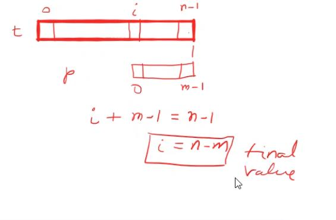

# Session 11 

- Search 
- String matching 


## Searching 

Linear search algorithm :

Quite an unique method : 
```c
int linear_Search(int* a,int n,int key){
  int i=0;
  while( i<n && a[i]!=key ) //depenmds heavily on short circuit eval 
    i++;
  return i;
}
```
Where did the statement go to check if i<n? Well we return -1 was simply just a practice, n is as invalid as -1, hence returning n is also fine when not found, in fact this is what C++ stl library does.

Program's with less if statements is always preferrable for the CPU as if statements usually mess around with the CPU cache.

A little modification to the above :

- Worst case found or not found : n-1 comparision 

```c
int linear_Search(int* a,int n,int key){ //the array is increased in size 
  int i=0;
  a[n] = key
  while( i<n && a[i]!=key ) //depenmds heavily on short circuit eval 
    i++;
  return i;
}
```
Same behaviour as previous algorithm with better computation, this extra space idea is called an sentinel guard and is observed in c strings with the NULL character.
- Worst case if not found : n+1 
  - if found : n

Try implmenting the linear search with sentinel without the extra space with a temp var, and mail it to him

Later we will see the correct value for an sentinel value.

Write an algorithm to check for some other property of the function (predicate). This can be done using callback, clown me forgot they exist in C : 
 Read [here](https://www.geeksforgeeks.org/callbacks-in-c/) to learn about callbacks.


 ```c
 int linear_search_predicate(int* a,void (*predicate)()){
  int i=0;
  while(i<n && !predicate(a[i]))
    i++;
  return i;
 }
 ```

The have function is without sentinel values, but how do we select a sentinel value for varying predicate? Simply it's variable.

So when the predicate is perfect square : sentinel is a perfect square 
So when searching for odd : sentinel is a odd number 

cppreference is a good website to learn about stl functions

is_any : predicate true for any one : E existential quantifier 
is_all : predicate true foe all :  inverted A - universal quantifier 

## String Matching 
- text [0..n-1]
- pattern[0..m-1] m<=n

> NSK used to give special course of regex and he also does advanced algorithms, anyways..back to algorithms 

```c
bool string_match(int* txt, int* pat,int n,int m){
  int i=0;
  int res==0;
  while(i<=n-m && !res){ //the <= is ver imp
    int j=0;
    while(j<m && txt[i+j] == pat[j])
      j++;
    if(j==m)
      res = i;
    i++;
  }
  return res;
}
```

- input size : n m
- basic op : key char comparision
- best case : m : linear m=n

ver good question from text book : 


Answer : 5*996,996,2*996

another one : 


Answer : 42
